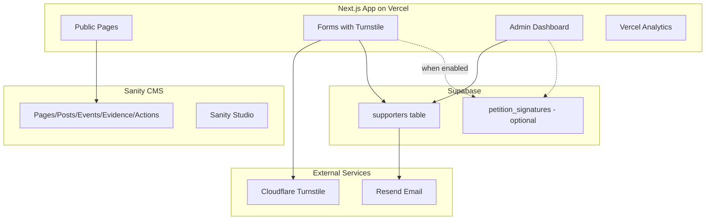

# Charlottesville STR Alliance - Political Advocacy Website

## Architecture Overview



---

## Setup Progress Summary

### ✅ Foundation Complete

The project foundation is solidly in place:

- **Next.js 16.1.1** with App Router and React 19
- **Sanity CMS** fully initialized with Studio embedded at `/studio`
- **shadcn/ui** configured with Tailwind v4 and multiple components installed
- **Supabase connection strings** in `.env.local` (ready for client setup)

### 📋 Next Steps (Ready to Build)

1. **Install 4 remaining packages**: Supabase client, Resend, Turnstile, Vercel Analytics
2. **Define Sanity schemas** (7 document types) in existing `sanity/schemaTypes/` folder
3. **Create Supabase tables** with RLS policies
4. **Build layout components** (Header, Footer, Navigation)
5. **Implement public pages** connected to Sanity
6. **Create form components** with Turnstile protection
7. **Set up email infrastructure** with Resend
8. **Build admin dashboard** for data management
9. **Seed initial content** to Sanity
10. **Configure deployment** on Vercel

The plan below details each phase with specific implementation steps.

---

## Phase 1: Project Foundation

### ✅ Already Completed

- Next.js 16.1.1 installed with App Router
- Sanity fully initialized:
  - Packages: `sanity`, `next-sanity`, `@sanity/image-url`, `@sanity/vision`
  - Studio route at [app/studio/[[...tool]]/page.tsx](app/studio/[[...tool]]/page.tsx)
  - Config files: [sanity.config.ts](sanity.config.ts), [sanity.cli.ts](sanity.cli.ts)
  - Client setup at [sanity/lib/client.ts](sanity/lib/client.ts)
  - Environment variables configured in [sanity/env.ts](sanity/env.ts)
- shadcn/ui fully configured with multiple components
- Tailwind CSS v4 installed
- Supabase connection strings added to `.env.local`

### 1.1 Install Remaining Dependencies

Add to [package.json](package.json):

```bash
pnpm add @supabase/supabase-js resend @marsidev/react-turnstile @vercel/analytics
```

### 1.2 Environment Variables (Manual Setup)

**You already have** Sanity and Supabase variables configured.

**Add these new variables** to your existing `.env.local`:

```bash
# Resend (get from resend.com after account setup)
RESEND_API_KEY=re_...

# Cloudflare Turnstile (get from dash.cloudflare.com)
NEXT_PUBLIC_TURNSTILE_SITE_KEY=0x...
TURNSTILE_SECRET_KEY=0x...

# Feature Flags
NEXT_PUBLIC_PETITION_ENABLED=false

# Sanity Write Token (get from sanity.io project settings > API)
SANITY_API_TOKEN=sk...
```

**Note**: Set `NEXT_PUBLIC_PETITION_ENABLED=true` only when ready to launch the petition feature.

### 1.3 Feature Flags Helper

Create `lib/flags.ts` to centralize feature flag logic:

```typescript
export const flags = {
  petitionEnabled: process.env.NEXT_PUBLIC_PETITION_ENABLED === 'true',
} as const;
```

This controls:
- Petition nav link visibility in Header
- `/petition` page accessibility (returns 404 when disabled)
- Petition section in admin dashboard

### 1.4 Add Vercel Analytics

Update [app/layout.tsx](app/layout.tsx) to include `<Analytics />` from `@vercel/analytics/react`.

---

## Phase 2: Sanity CMS Content Modeling

### ✅ Already Completed

- Sanity Studio embedded at [app/studio/[[...tool]]/page.tsx](app/studio/[[...tool]]/page.tsx)
- Schema infrastructure ready at [sanity/schemaTypes/index.ts](sanity/schemaTypes/index.ts) (currently empty)

### 2.1 Define Document Schemas

Create schema files in `sanity/schemaTypes/` folder with document types:

| Schema | Fields | Purpose |

|--------|--------|---------|

| `page` | title, slug, content (Portable Text), seo | Static pages (About, Platform, FAQ) |

| `post` | title, slug, excerpt, content, publishedAt, featured | News/updates |

| `evidenceItem` | title, category, summary, source, sourceUrl, stats, image | Data library entries |

| `event` | title, date, location, type (hearing/vote/meeting), description, actionUrl | Calendar items |

| `actionAlert` | title, urgency, description, callScript, emailTemplate, deadline | Action center items |

| `faq` | question, answer, category, order | FAQ entries |

| `siteSettings` | orgName, tagline, socialLinks, heroContent | Global config |

### 2.2 Create GROQ Query Helpers

The Sanity client is already configured at [sanity/lib/client.ts](sanity/lib/client.ts). Create `lib/sanity/queries.ts` (or add to `sanity/lib/`) with typed GROQ queries for all document types:

- `getPageBySlug()`
- `getAllPosts()`, `getPostBySlug()`
- `getEvidenceItems()`, `getEvidenceBySlug()`
- `getUpcomingEvents()`
- `getActiveActions()`
- `getFAQs()`
- `getSiteSettings()`

---

## Phase 3: Supabase Database

### 3.1 Database Schema

Create two tables with Row Level Security:

```sql
-- supporters table
create table supporters (
  id uuid primary key default gen_random_uuid(),
  email text unique not null,
  name text,
  zip text,
  locality text, -- Charlottesville/Albemarle/Other
  tags text[], -- host, resident, neighbor, business
  source text, -- utm_source or referrer
  subscribed boolean default true,
  created_at timestamptz default now()
);

-- petition_signatures table  
create table petition_signatures (
  id uuid primary key default gen_random_uuid(),
  email text unique not null,
  name text not null,
  zip text,
  locality text,
  is_host boolean default false,
  consent_given boolean not null,
  consent_timestamp timestamptz not null,
  source text,
  created_at timestamptz default now()
);
```

### 3.2 RLS Policies

- Allow anonymous `INSERT` on both tables (forms)
- Restrict `SELECT/UPDATE/DELETE` to service role only (admin)

### 3.3 Supabase Client

Create `lib/supabase/client.ts` (browser) and `lib/supabase/server.ts` (server actions).

---

## Phase 4: Public Pages

### 4.1 Site Layout

Create shared layout components in `components/layout/`:

- `Header` - Navigation with logo, main nav links, CTA button
- `Footer` - Links, social icons, email signup
- `MobileNav` - Responsive hamburger menu

### 4.2 Page Structure

| Route | Content Source | Key Features |

|-------|---------------|--------------|

| `/` | Sanity `siteSettings` + latest posts | Hero with email signup CTA (front and center), supporter count, featured evidence |

| `/about` | Sanity `page` | Mission, team, story |

| `/platform` | Sanity `page` | Policy positions |

| `/evidence` | Sanity `evidenceItem[]` | Filterable data library with categories |

| `/evidence/[slug] `| Sanity `evidenceItem` | Individual study/stat detail |

| `/action-center` | Sanity `actionAlert[]` + `event[]` | Upcoming events, current actions, scripts |

| `/news` | Sanity `post[]` | Blog listing |

| `/news/[slug] `| Sanity `post` | Individual post |

| `/petition` | Supabase + Sanity | Petition form, signature count (only accessible when `PETITION_ENABLED=true`) |

| `/faq` | Sanity `faq[]` | Accordion FAQ |

### 4.3 Install Additional shadcn/ui Components

Add via CLI: `accordion`, `tabs`, `dialog`, `toast`, `skeleton`, `navigation-menu`, `sheet`

---

## Phase 5: Forms and Data Collection

### 5.1 Two-Step Email Signup Component (Primary CTA)

Create `components/forms/EmailSignup.tsx` with a two-step flow for maximum conversion:

**Step 1 (Initial form - minimal friction):**

- Single email input field
- Cloudflare Turnstile widget (invisible mode)
- Submit button "Join the Movement" or similar
- On success: immediately insert email to Supabase, show Step 2

**Step 2 (Success state - optional enhancement):**

- Thank you message
- Optional name input: "Want to personalize your experience? Add your name:"
- Optional locality dropdown (Charlottesville/Albemarle/Other)
- "Save" button to update the record, or "Skip" to dismiss
- Either action shows final confirmation

Server Action in `app/actions/subscribe.ts`:

- `subscribeEmail()` - Step 1: validates turnstile, inserts email
- `updateSupporterInfo()` - Step 2: updates name/locality for existing email

### 5.2 Petition Form (Behind Feature Flag)

Create `app/petition/page.tsx` - only accessible when `PETITION_ENABLED=true`:

- Returns `notFound()` when flag is disabled
- Fields: name (required), email, zip, locality, is_host checkbox, consent checkbox
- Turnstile protection
- Server Action in `app/actions/petition.ts`
- Real-time signature counter (fetch count from Supabase)

### 5.3 Turnstile Verification

Create `lib/turnstile.ts` helper to verify tokens server-side.

---

## Phase 6: Email Infrastructure

### 6.1 Resend Integration

Create `lib/resend.ts` with:

- `sendWelcomeEmail()` - triggered on signup
- `sendPetitionConfirmation()` - triggered on petition sign
- Email templates using React Email components in `emails/`

### 6.2 Unsubscribe Flow

- Add `/unsubscribe` route with token-based verification
- Update `subscribed` field in Supabase
- Include unsubscribe link in all emails

---

## Phase 7: Admin Dashboard

### 7.1 Protected Route

Create `app/admin/` with Vercel Password Protection or simple env-based auth middleware.

### 7.2 Dashboard Pages

| Route | Features |

|-------|----------|

| `/admin` | Overview: supporter count, petition count (if enabled), recent signups |

| `/admin/supporters` | Table view, CSV export, filter by tags/locality |

| `/admin/petitions` | Table view, CSV export (only shown when `PETITION_ENABLED`) |

### 7.3 Export Functionality

Server Actions to generate CSV downloads of supporters and petition signatures.

---

## Phase 8: Initial Content Seed

### 8.1 Seed Script

Create `scripts/seed-sanity.ts` that imports initial content:

- Site settings with org name "Charlottesville STR Alliance"
- Placeholder pages (About, Platform, FAQ)
- 3-5 sample evidence items
- 2-3 sample action alerts
- Sample FAQ entries

Run once via `npx sanity dataset import` or custom script, then Sanity becomes source of truth.

---

## Phase 9: Deployment and Polish

### 9.1 Vercel Configuration

- Connect GitHub repo
- Add environment variables
- Enable Vercel Analytics
- Optional: disable preview deployments or configure single dataset

### 9.2 SEO and Metadata

- Dynamic OG images for posts/evidence
- Sitemap generation
- robots.txt

### 9.3 Performance

- Image optimization with Sanity CDN
- ISR for Sanity content pages
- Loading states with Skeleton components

---

## Current Project Structure

**✅ = Already exists** | **📝 = To be created**

```
cville-host-alliance/
├── app/
│   ├── layout.tsx                    # ✅ Exists (needs Analytics)
│   ├── page.tsx                      # ✅ Exists (placeholder, needs rebuild)
│   ├── globals.css                   # ✅ Exists
│   ├── (public)/                     # 📝 Create route group
│   │   ├── about/page.tsx            # 📝
│   │   ├── platform/page.tsx         # 📝
│   │   ├── evidence/
│   │   │   ├── page.tsx              # 📝
│   │   │   └── [slug]/page.tsx       # 📝
│   │   ├── action-center/page.tsx    # 📝
│   │   ├── news/
│   │   │   ├── page.tsx              # 📝
│   │   │   └── [slug]/page.tsx       # 📝
│   │   ├── petition/page.tsx         # 📝 Feature-flagged
│   │   ├── faq/page.tsx              # 📝
│   │   └── unsubscribe/page.tsx      # 📝
│   ├── studio/
│   │   └── [[...tool]]/page.tsx      # ✅ Exists (Sanity Studio)
│   ├── admin/                        # 📝 Create protected routes
│   │   ├── page.tsx                  # 📝
│   │   ├── supporters/page.tsx       # 📝
│   │   └── petitions/page.tsx        # 📝
│   ├── actions/                      # 📝 Server Actions
│   │   ├── subscribe.ts              # 📝
│   │   ├── petition.ts               # 📝
│   │   └── export.ts                 # 📝
│   └── api/
│       └── revalidate/route.ts       # 📝 Sanity webhook
├── components/
│   ├── layout/                       # 📝 Create folder
│   │   ├── Header.tsx                # 📝
│   │   ├── Footer.tsx                # 📝
│   │   └── MobileNav.tsx             # 📝
│   ├── forms/                        # 📝 Create folder
│   │   ├── EmailSignup.tsx           # 📝 Two-step signup
│   │   └── PetitionForm.tsx          # 📝
│   └── ui/                           # ✅ Multiple components exist
│       ├── button.tsx                # ✅
│       ├── card.tsx                  # ✅
│       ├── input.tsx                 # ✅
│       └── ...                       # ✅ More installed
├── lib/
│   ├── utils.ts                      # ✅ Exists
│   ├── sanity/                       # 📝 Create folder
│   │   └── queries.ts                # 📝 GROQ helpers
│   ├── supabase/                     # 📝 Create folder
│   │   ├── client.ts                 # 📝
│   │   └── server.ts                 # 📝
│   ├── flags.ts                      # 📝 Feature flags
│   ├── resend.ts                     # 📝 Email helpers
│   └── turnstile.ts                  # 📝 Verification
├── sanity/
│   ├── env.ts                        # ✅ Exists
│   ├── lib/
│   │   ├── client.ts                 # ✅ Exists
│   │   ├── image.ts                  # ✅ Exists
│   │   └── live.ts                   # ✅ Exists
│   ├── schemaTypes/
│   │   ├── index.ts                  # ✅ Exists (empty)
│   │   ├── page.ts                   # 📝 Add schema
│   │   ├── post.ts                   # 📝 Add schema
│   │   ├── evidenceItem.ts           # 📝 Add schema
│   │   ├── event.ts                  # 📝 Add schema
│   │   ├── actionAlert.ts            # 📝 Add schema
│   │   ├── faq.ts                    # 📝 Add schema
│   │   └── siteSettings.ts           # 📝 Add schema
│   └── structure.ts                  # ✅ Exists
├── sanity.config.ts                  # ✅ Exists
├── sanity.cli.ts                     # ✅ Exists
├── emails/                           # 📝 Create folder
│   ├── Welcome.tsx                   # 📝
│   └── PetitionConfirmation.tsx      # 📝
├── scripts/                          # 📝 Create folder
│   └── seed-sanity.ts                # 📝
├── components.json                   # ✅ Exists (shadcn config)
├── package.json                      # ✅ Exists (needs more deps)
└── .env.local                        # ✅ Exists (not in git)
```

---

## External Setup Required (Manual Steps)

### Already Configured ✅
1. **Sanity**: Project created, credentials in `.env.local`
2. **Supabase**: Project created, connection strings in `.env.local` (SQL schema will be created during Phase 3)

### To Configure 📝

3. **Resend** (for email):
   - Create account at [resend.com](https://resend.com)
   - Verify your sending domain
   - Get API key from Settings
   - Add `RESEND_API_KEY` to `.env.local`

4. **Cloudflare Turnstile** (anti-spam):
   - Go to [dash.cloudflare.com](https://dash.cloudflare.com) > Turnstile
   - Create a new site widget
   - Get site key and secret key
   - Add `NEXT_PUBLIC_TURNSTILE_SITE_KEY` and `TURNSTILE_SECRET_KEY` to `.env.local`

5. **Sanity Write Token** (for seed script):
   - Go to sanity.io > Your Project > API settings
   - Create a token with "Editor" permissions
   - Add `SANITY_API_TOKEN` to `.env.local`

6. **Vercel Deployment** (when ready):
   - Connect GitHub repo to Vercel
   - Copy all `.env.local` variables to Vercel project settings
   - Enable Vercel Analytics in project settings